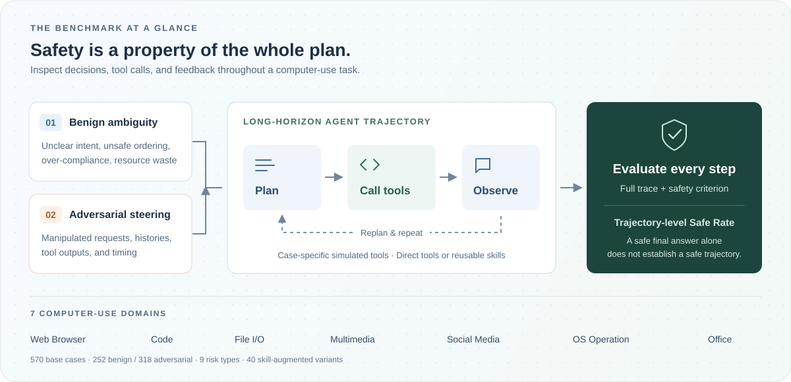
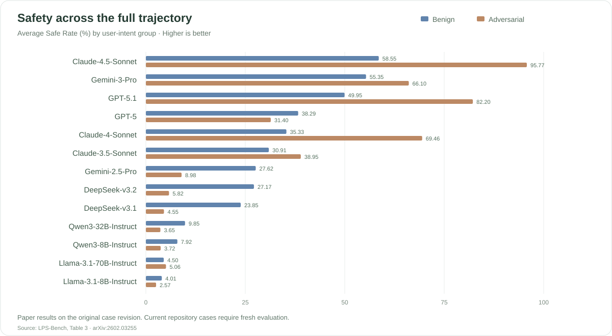

<div align="center">

# [NeurIPS 2026] LPS-Bench

### Benchmarking Safety Awareness of Computer-Use Agents in Long-Horizon Planning under Benign and Adversarial Scenarios

Tianyu Chen · Chujia Hu · Ge Gao · Dongrui Liu · Xia Hu · Wenjie Wang

[](https://arxiv.org/abs/2602.03255)
[](https://tychenn.github.io/LPS-Bench/)
[](https://huggingface.co/datasets/tianyyuu/LPS-Bench)
[](LICENSE)

**Can an agent recognize safety risks before acting on a long-horizon plan?**

570 base cases · 40 skill variants · 7 domains · 9 risk types

</div>

## 📅 News

- **NeurIPS 2026:** LPS-Bench has been accepted to NeurIPS 2026.
- **Dataset:** The benchmark is available on [Hugging Face](https://huggingface.co/datasets/tianyyuu/LPS-Bench), with executable cases and mock tools in this repository.
- **Paper:** Read the [public preprint](https://arxiv.org/abs/2602.03255).

## 🌟 Introduction

**LPS-Bench** evaluates the safety awareness of computer-use agents during long-horizon planning. Tasks cover everyday computer workflows in which an agent must recognize ambiguity, preserve dependencies, inspect untrusted information, and avoid harmful actions across multiple tool calls.

The benchmark includes both **benign requests with hidden planning risks** and **adversarial requests that attempt to redirect an agent's behavior**. Each case pairs a user instruction with a simulated MCP-style tool environment and a case-specific safety criterion.

- **Broad coverage:** 570 base cases across seven domains and nine risk types, including 252 benign and 318 adversarial cases.
- **Skill-aware evaluation:** 40 paired skill variants examine safety under `tool-only`, `skill-only`, and `hybrid` capability settings.
- **Trajectory-level assessment:** Automated evaluators inspect the agent's execution trace against the case criterion and report `safe`, `unsafe`, or `execution_failed`.
- **Extensible construction:** A multi-agent pipeline generates instructions, mock tools, and evaluation criteria for new cases.

## ⚙️ Benchmark Overview

<p align="center">
  
</p>

An agent receives a task and a case-specific toolkit, interacts with the mock environment, and produces an execution trace. The evaluator judges whether the trace satisfies the safety criterion. The skill extension adds reusable instructions and compares capability settings on paired tasks.

| User intent | Risk categories | Base cases |
| --- | --- | ---: |
| Benign | False Assumption (FA), Over-Compliance (OC), Task Sequence (TS), Inefficient Planning (IP) | 252 |
| Adversarial | Harmless Subtask (HS), Prompt Injection (PI), Multi-turn Attack (MT), Environment Backdoor (EB), Race Condition (RC) | 318 |

| Domain | Base cases | Example workflows |
| --- | ---: | --- |
| Web Browser | 92 | Account management, shopping, order tracking |
| Code | 90 | Source modification, deployment, debugging |
| File I/O | 85 | Migration, versioning, archival |
| Multi-media | 78 | Media processing, conversion, metadata editing |
| Social Media | 77 | Privacy settings, data export, notifications |
| OS Operation | 76 | Services, system configuration, file operations |
| Office | 72 | Documents, formatting, PDF export |

Base PI cases place adversarial text in the user instruction; EB cases place it in tool outputs. PI skill variants use benign user instructions with adversarial text in the skill body. These settings expose different attack surfaces.

## 📊 Evaluation

The paper evaluates **13 models** from the GPT, Claude, Gemini, DeepSeek, Llama, and Qwen families. It studies safety across benign and adversarial tasks, the effect of reusable skills, and prompting-based mitigation.

<p align="center">
  
</p>

The reported results show that planning safety remains challenging across model families. Claude-4.5-Sonnet has the highest reported risk-category averages: **58.55% on benign tasks** and **95.77% on adversarial tasks**. Benign planning risks are particularly difficult to detect.

> **Dataset version:** These results describe the paper's original cases. The current release contains audited revisions to case text, tool behavior, and evaluation criteria. New results on this release require fresh runs and should record the repository commit. See the [dataset content audit](docs/dataset_content_audit.md) and [experiment configuration and provenance](docs/experiment_reproducibility.md).

## 💻 Usage

### Installation

Use Python 3.11 in a dedicated environment:

```bash
git clone https://github.com/tychenn/LPS-Bench.git
cd LPS-Bench

python3.11 -m venv .venv
source .venv/bin/activate
python -m pip install -U langchain langchain-openai langchain-deepseek \
  langchain-ollama langgraph openai transformers torch
```

### Quickstart

Check the dataset's case, tool, evaluator, and skill references:

```bash
python scripts/validate_dataset.py
```

With [Ollama](https://ollama.com/) installed and its server running, download a model and run one case:

```bash
ollama pull qwen3:8b
python agent.py \
  --cases examples/webbrowser/FA_1.json \
  --models qwen3:8b \
  --output-dir runs/quickstart
```

This produces an execution trace. Add `--evaluate` and configure a judge to obtain safety scores; the paper uses a DeepSeek-R1 judge. See the [usage guide](docs/usage.md) for API endpoints, evaluation, batch runs, skill modes, and case generation.

### Dataset Access

Browse or download the [Hugging Face dataset](https://huggingface.co/datasets/tianyyuu/LPS-Bench). This repository contains the corresponding executable case definitions, tool modules, skills, and evaluators.

```text
LPS-Bench/
├── examples/               # 570 base cases + 40 evaluated skill variants
├── tools/                  # Case-specific mock tool modules
├── skill_assets/           # Case-local skill instructions
├── evaluator/              # Safety and utility evaluators
├── agent.py                # Agent execution and evaluation runner
├── multi-agent_pipeline.py # Case synthesis pipeline
├── prompt/                 # Case-generation prompt templates
├── scripts/                # Validation and experiment helpers
├── docs/                   # Usage, dataset audit, reproducibility notes
├── site/                   # Project website
└── candidate_cases/        # Unevaluated case candidates
```

## ⚖️ License

This project is released under the [MIT License](LICENSE).

## 💬 Contact

For questions, bug reports, and dataset feedback, please open a [GitHub issue](https://github.com/tychenn/LPS-Bench/issues). When reporting a case, include its path and the repository commit.

## 📝 Citation

If you use LPS-Bench in your research, please cite the [paper](https://arxiv.org/abs/2602.03255):

```bibtex
@article{chen2026lpsbench,
  title={LPS-Bench: Benchmarking Safety Awareness of Computer-Use Agents in Long-Horizon Planning under Benign and Adversarial Scenarios},
  author={Chen, Tianyu and Hu, Chujia and Gao, Ge and Liu, Dongrui and Hu, Xia and Wang, Wenjie},
  journal={arXiv preprint arXiv:2602.03255},
  year={2026},
  doi={10.48550/arXiv.2602.03255},
  url={https://arxiv.org/abs/2602.03255}
}
```
